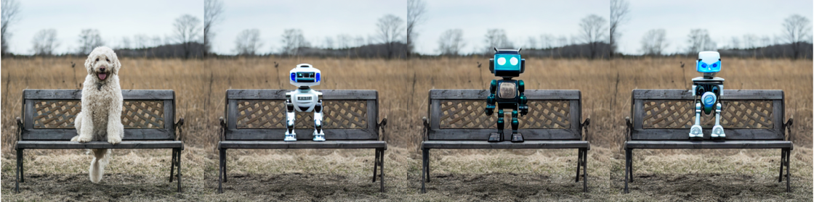
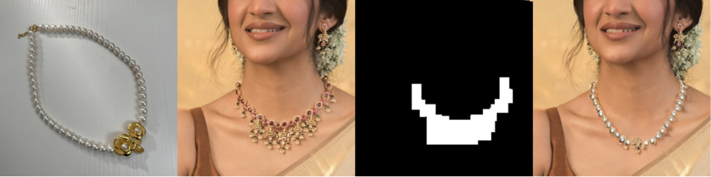
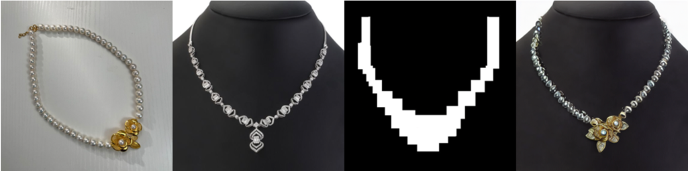

# Stable Diffusion Dreambooth Inpainting Finetuning 🎨🪄

This repository provides an engaging illustration on how to unleash the power of Stable Diffusion to finetune an inpainting model with your own images.

Inpainting, simply put, it's a technique that allows to fill in missing parts of an image.
By leveraging fine-tuning you to replace any custom mask on your image with the finetuned object, offering you the reigns to create custom scenarios that depict your finetuned object.

Try it out:

## Why should you finetune an inpainting model? 🚀

This technique can be particularly useful for marketers, sellers, and content creators who'd love to experiment with images.
For instance, in the context of e-commerce, it is possible to generate striking images of your products in curated scenarios or by showcasing your products as worn by digital human models.

Stable Diffusion inpainting example for e-commerce below:

